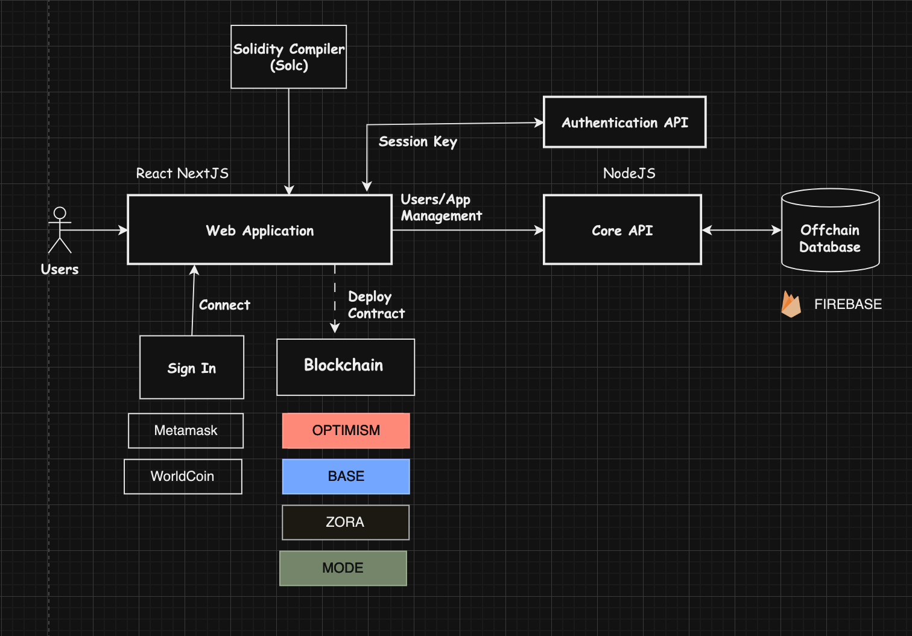
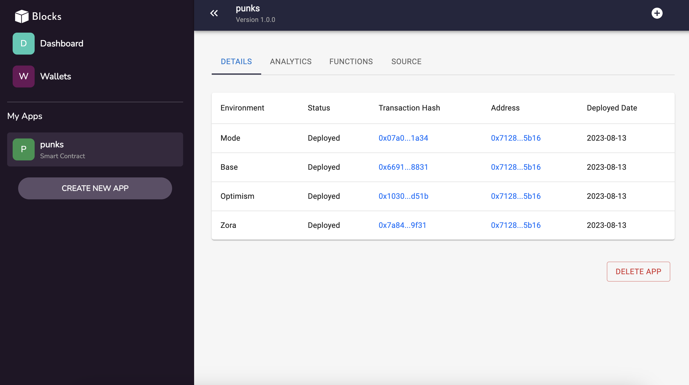

# Blocks

## Blocks simplifies creating, compiling, deploying and managing smart contracts.

**Project Goal**: We want to give anyone the ability to effortlessly create, deploy, manage, and gain insights into their smart contracts. 

**Project Website**: [website](https://blocks-xdc.vercel.app/)

**Please note**: This alpha version of the application is for testing and development purposes only. The final version may differ significantly in terms of features, appearance, and functionality.

# Blocks: Smart Contracts Manager

    

## Inspiration

We asked ourselves:
"How can we make the power of blockchain technology and smart contracts accessible to everyone, regardless of their technical proficiency?"

The inspiration for Blocks comes from the understanding that blockchain technology and smart contracts hold vast potential to revolutionize various aspects of our digital lives. Yet, this potential remains largely untapped because of the technical complexity associated with creating and managing decentralized applications (dApps).

We wanted to provide a solution that didn't just cater to expert developers, but also to non-technical users who have great ideas but lack the coding skills to translate those ideas into functional dApps.

This led us to the conception of Blocks - a platform designed to enable anyone to effortlessly create, deploy, manage, and gain insights into their smart contracts. 

## About the Project

**Simplified way to manage smart contracts.**

Blocks is a user-friendly blockchain app manager for the **XDC Blockchain** blockchain. It enables effortless creation, deployment, management, and analysis of smart contracts for both beginners and expert blockchain engineers. 

With no-code templates, multiple wallet integrations, and robust analytics, it caters to both beginners and advanced users, democratizing access to blockchain technology and paving the way for a more decentralized digital future.

## Features

    

    

**No Code Contract Builder**
- Build your contracts from a growing collection of preset templates you can use and customize, no coding required.

**App Manager**
- Create multiple apps, each having their own smart contract properly organized providing you with a holistic view of your dapps.

**Build in Solidity Compiler**
- Compile your smart contracts directly on the platform.

**Build in Contract Deployer**
- Deploy on XDC mainnet and testnet with just a button click.

**Coming Soon**
- For advanced users: Build contracts with custom code.
- Import existing contracts that has been deployed.
- Link multiple wallets
- App version management
- Contract Analytics and Insights

## Business Model

    

While we strive to keep the majority of features free so anyone can experience and use BlockFabric, we plan to introduce a freemium model in the future to sustain the project's development. The platform will still remain free for basic use, and allows unlimited restrictions for paid users.

**Community Contributed Templates**: We are also considering to open up our templates collection so other developers can build and share their templates and possibly earn commission from their use.

## Technical Details

### Architecture Overview

    

#### Web Application & APIs

- The frontend Web Application is developed in **React** using the **NextJS** framework. The authentication and core APIs are developed in NodeJS.
- These applications are hosted on [Vercel](https://www.vercel.com).

#### Compiler
- [Solidity Compiler (Solc)](https://www.npmjs.com/package/solc) is used for compiling Solidity code into Contract Application Binary Image (ABI) and byte code.

#### Contract Interactions/Deployments
- [Web3.js](https://github.com/web3/web3.js) is the library we use for all contract interactions, including deployments.

#### Offchain Database

- The offchain database is used to store the encrypted messages and various operations of the application. 
- The database is hosted on [Google Firebase](https://firebase.google.com) using the Firestore service.

### Process Flow

    

#### Connect Wallet & Handshaking
- Users first connect to XDC Blockchain using a wallet provider like XDCPay. After connecting, user then signs a message to the Authentication API, which verifies the signed message and returns a generated JWT token for access to the Core API.

#### Creating an App
- Users would create their first app after accessing the platform. An app is a container that will hold and manage the smart contract. Users can create multiple apps.

#### Contract Details & Compilation
- Setting up an app is quick easy with only a few steps: selecting mode (build from template, custom code, or existing contract import).
- In Build from Template, the steps would require selecting a template, entering contract details, review generated code and compile.

#### Publishing
- Once a contract is compiled within an app, it can be deployed with just a click. Apps deployed can then collect tranasction data from the blockchain for insights and analytics.

## Project Roadmap

**Q2 2023**
- Project inception, planning and prototyping
- MVP product engineering and development
- Beta launch on mainnet

**Q3 & Q4 2023**
- Feature implementation and refinements
    - Version management, wallet management, analytics and insights
    - Contract import and custom code
    - More preset templates
- Public outreach and marketing
- Launch of complete and stable version on mainnet

## Screenshots

    

    

    

    

    

    

